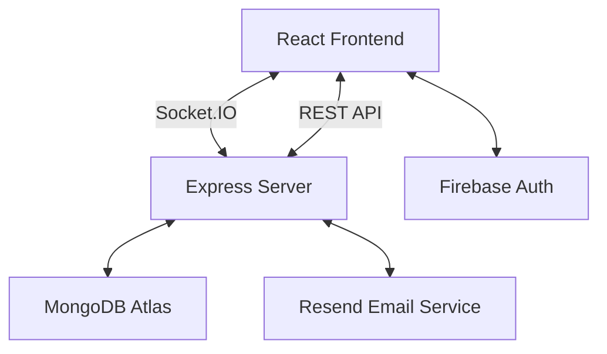

# Connect Messenger 🚀

Connect Messenger is a professional, high-performance real-time chat application designed for enterprise and personal communication. Built with the MERN stack (MongoDB, Express, React, Node.js) and powered by Socket.IO, it offers an "instant" messaging experience comparable to platforms like WhatsApp Web and Telegram Web.

---

## 🌟 Key Features

### 💬 Messaging
- **Real-time Communication**: Instant message delivery using Socket.IO.
- **Optimistic UI**: Messages appear instantly in the sender's UI before database confirmation.
- **One-to-One Chat**: Private, secure conversations between users.
- **Message History**: Persistent storage with cursor-based pagination for smooth scrolling.
- **Media Sharing**: Support for sharing images, videos, and documents with client-side compression.
- **Typing Indicators**: Real-time "typing..." feedback.
- **Read Receipts**: Visual confirmation of message delivery.
- **Reply System**: Quote and reply to specific messages.
- **Delete & Clear**: Options to delete individual messages or clear entire chat histories.

### 👤 Profile & Presence
- **Online/Offline Status**: Real-time tracking of user availability.
- **Last Seen**: Accurate timestamp of a user's last activity.
- **Profile Management**: Customizable display names, bios, and profile pictures.
- **Avatar System**: Dynamic avatars with zoom functionality.

### 🛠️ User Experience
- **Recent Chats**: Sidebar listing all ongoing conversations sorted by latest activity.
- **Dark/Light Mode**: Seamless theme switching with persistent user preference.
- **Search**: Fast filtering of recent chats and online users.
- **Responsive Design**: Fully optimized for desktop and mobile browsers.

### 🔐 Security & Administration
- **Authentication**: Secure user login/registration powered by **Firebase Authentication**.
- **Admin Dashboard**: Specialized OTP-based secure login for administrators to monitor stats, messages, and feedback.
- **Data Encryption**: Message payloads are encrypted before storage.

---

## 🛠️ Technology Stack

### **Frontend**
- **React (v19)**: Component-based UI development.
- **Socket.IO Client**: Real-time bidirectional communication.
- **Framer Motion**: Smooth animations and transitions.
- **Lucide React**: Professional icon set.
- **Axios**: HTTP client for API requests.
- **Firebase SDK**: Handles user authentication.

### **Backend**
- **Node.js & Express**: Scalable server-side architecture.
- **Socket.IO**: WebSocket management for real-time events.
- **Mongoose**: MongoDB object modeling.
- **JWT**: Secure token-based authentication for admin routes.
- **Resend**: For sending OTPs and feedback notifications via email.

### **Database**
- **MongoDB Atlas**: Cloud-hosted NoSQL database for messages, profiles, and metadata.

---

## 🏗️ Project Architecture



---

## 📁 Directory Structure

```text
c:/rohan/chat/
├── client/                 # React Frontend
│   ├── public/             # Static assets
│   ├── src/
│   │   ├── components/     # UI Components (Chat, Sidebar, Message, etc.)
│   │   ├── context/        # React Context (SocketContext)
│   │   ├── hooks/          # Custom Hooks (useSocket, useChatSocket)
│   │   ├── services/       # API and Socket services
│   │   ├── utils/          # Helper functions (timeFormatter, etc.)
│   │   └── App.js          # Main entry point & Routing
│   └── package.json
│
├── server/                 # Node.js Backend
│   ├── config/             # Database and Environment config
│   ├── controllers/        # Business logic for routes
│   ├── middleware/         # Auth and validation middleware
│   ├── models/             # Mongoose schemas (Message, UserProfile, etc.)
│   ├── routes/             # API endpoints
│   ├── services/           # Email service (Resend)
│   ├── socket/             # Socket.IO event handlers
│   ├── utils/              # Security and helper utilities
│   └── index.js            # Server entry point
│
└── package.json            # Root configuration
```

---

## 📨 Message Flow

1. **User Input**: User types a message and clicks "Send".
2. **Optimistic Update**: The frontend instantly adds the message to the UI with a `pending` status.
3. **Socket Emit**: The `send-message` event is emitted to the server.
4. **Instant Broadcast**: The server immediately emits `receive-message` to the recipient's room (before DB save).
5. **Persistence**: The server saves the encrypted message to **MongoDB Atlas**.
6. **Confirmation**: Once saved, the server emits `message-saved` back to the sender to remove the `pending` state and update the message ID.
7. **UI Synchronization**: Both sender and recipient's UIs are kept in sync via real-time socket events.

---

## 📊 Database Design

### Collections
- **UserProfile**: Stores user metadata (email, display name, bio, profile picture URL, last seen, online status).
- **Message**: Stores chat messages (sender, receiver, encrypted text, type, media metadata, timestamps).
- **ArchivedChat**: Tracks which users have archived specific conversations.
- **ClearedChat**: Stores "cleared at" timestamps for users who have cleared their chat history.
- **Feedback**: Stores user-submitted feedback and bug reports.

---

## 🛣️ API Documentation

### **Users**
| Method | Endpoint | Description |
| :--- | :--- | :--- |
| `POST` | `/api/users` | Create or update user profile. |
| `PUT` | `/api/users/avatar` | Update user profile picture. |

### **Messages**
| Method | Endpoint | Description |
| :--- | :--- | :--- |
| `GET` | `/api/messages` | Fetch message history between two users (paginated). |
| `GET` | `/api/messages/recent` | Fetch list of recent conversations for a user. |
| `POST` | `/api/messages/archive` | Archive a specific conversation. |
| `POST` | `/api/messages/clear-all` | Clear all recent chat history for a user. |

### **Admin**
| Method | Endpoint | Description |
| :--- | :--- | :--- |
| `POST` | `/api/admin/send-otp` | Request OTP for admin login. |
| `POST` | `/api/admin/verify-otp` | Verify OTP and receive JWT. |
| `GET` | `/api/admin/stats` | (Auth) Get system-wide statistics. |
| `GET` | `/api/admin/messages` | (Auth) Monitor all system messages. |

---

## 📡 Socket.IO Events

| Event Name | Type | Description |
| :--- | :--- | :--- |
| `join` | Emit | Inform server that user is online. |
| `join-room` | Emit | Join a specific 1-to-1 chat room. |
| `send-message` | Emit | Send a new message or media. |
| `receive-message` | Listen | Receive a new message from another user. |
| `typing` | Emit/Listen | Notify/Receive that a user is typing. |
| `unread-update` | Listen | Get updated unread message counts. |
| `message-saved` | Listen | Confirmation that a message is persisted in DB. |

---

## ⚙️ Environment Variables

### **Server (.env)**
```env
PORT=5000
MONGO_URI=your_mongodb_atlas_uri
JWT_SECRET=your_jwt_secret
ADMIN_EMAIL=admin@example.com
RESEND_API_KEY=re_xxxxxxxxxxxx
EMAIL_FROM=your-verified-domain@yourdomain.com
FRONTEND_URL=http://localhost:3000
MESSAGE_ENCRYPTION_KEY=your_32_char_key
```

### **Client (.env)**
```env
REACT_APP_API_URL=http://localhost:5000
REACT_APP_SOCKET_URL=http://localhost:5000
# Firebase Config
REACT_APP_FIREBASE_API_KEY=...
REACT_APP_FIREBASE_AUTH_DOMAIN=...
REACT_APP_FIREBASE_PROJECT_ID=...
```

---

## 🚀 Installation & Setup

1. **Clone the Repo**
   ```bash
   git clone https://github.com/yourusername/connect-messenger.git
   cd connect-messenger
   ```

2. **Backend Setup**
   ```bash
   cd server
   npm install
   # Create .env and add variables
   npm start
   ```

3. **Frontend Setup**
   ```bash
   cd client
   npm install
   # Create .env and add variables
   npm start
   ```

---

## 🌐 Deployment

- **Frontend**: Optimized for **Vercel**. Configuration found in `vercel.json`.
- **Backend**: Deployable to **Render** or **Railway**. `render.yaml` provided for easy setup.
- **Database**: Use **MongoDB Atlas** (Free Tier) for managed persistence.

---

## 🔧 Troubleshooting

- **Socket Connection Fails**: Ensure `FRONTEND_URL` in server `.env` matches the client's actual URL.
- **MongoDB Errors**: Verify the IP Whitelist in your MongoDB Atlas dashboard.
- **OTP Not Sending**: Check if `RESEND_API_KEY` is set correctly and the `EMAIL_FROM` domain is verified in Resend.

---

## 🔮 Future Improvements

- **Group Chats**: Expand the socket logic to support multi-user rooms.
- **Voice/Video Calls**: Integrate WebRTC for real-time calling.
- **End-to-End Encryption**: Implement client-side encryption for maximum privacy.
- **Message Reactions**: Add emoji reactions to individual messages.